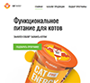

# Примеры работ

Название | Навыки | Скриншоты
|--------|---------|---------|
|Сайт Uber Еда  [ Код](https://github.com/dmitry-ios/uber-eats) • [ Главная](https://naughty-minsky-37325f.netlify.app/)|HTML, SCSS, JavaScript |  |
|Путешествие по Европе  [ Код](https://github.com/dmitry-ios/euro-trip) • [ Главная](https://focused-mcclintock-729c5f.netlify.app/)|HTML, SCSS, JavaScript |  |
|IP Address Tracker  [ Код](https://github.com/dmitry-ios/IP-Address-Tracker) • [ Главная](https://musing-newton-2daf03.netlify.app/)|HTML, SCSS, JavaScript|  |
|Кексобукинг  [ Код](https://github.com/dmitry-ios/1483875-keksobooking-21) • [ Главная](https://compassionate-austin-7a0844.netlify.app/)|Преимущественно JavaScript, готовая разметка и стили||
|Кэт энерджи  [ Код](https://github.com/dmitry-ios/1483875-cat-energy-20) • [ Главная](https://nifty-agnesi-d1bbc6.netlify.app/) • [ Каталог](https://nifty-agnesi-d1bbc6.netlify.app/catalog.html) • [ Форма](https://nifty-agnesi-d1bbc6.netlify.app/form.html)|HTML, Less, JavaScript|  |
|Нёрдс  [ Код](https://github.com/dmitry-ios/1483875-nerds-28) • [ Главная](https://boring-jennings-6c9769.netlify.app/) • [ Каталог](https://boring-jennings-6c9769.netlify.app/catalog.html)|HTML, CSS, JavaScript||
|Transhub 24  [ Код](https://github.com/dmitry-ios/Transhub24) • [ Главная](https://compassionate-lumiere-28ffc2.netlify.app/)|HTML, Less, JavaScript, немного jQuery|  |
|Седона  [ Код](https://github.com/dmitry-ios/sedona) • [ Главная](https://inspiring-mahavira-ed0a4e.netlify.app/) • [ Каталог](https://inspiring-mahavira-ed0a4e.netlify.app/catalog.html)|HTML, CSS||
|Код и Магия  [ Код](https://github.com/dmitry-ios/1483875-code-and-magick-21) • [ Главная](https://clever-wozniak-bbc709.netlify.app/)|Преимущественно JavaScript, готовая верстка||
|Profile Card Component  [ Код](https://github.com/dmitry-ios/profile-card) • [ Главная](https://jovial-ptolemy-0fcd6c.netlify.app/)|HTML, CSS, Vue.js| |
|Meeting Ended Modal  [ Код](https://github.com/dmitry-ios/template-example/tree/master/MeetingEndedModal) • [ Главная](https://jovial-curran-1fdece.netlify.app/)|HTML, CSS, JavaScript||
|Sign In Modal  [ Код](https://github.com/dmitry-ios/template-example/tree/master/SignIn) • [ Главная](https://focused-khorana-6c2795.netlify.app/)|HTML, CSS||
|The Great Keksby  [ Код](https://github.com/dmitry-ios/the-great-keksby) • [ Главная](https://sleepy-ramanujan-ebf175.netlify.app/)|HTML, CSS||
|Примеры работ  [ Код](https://github.com/dmitry-ios/dmitry-ios.github.io) • [ Главная](https://dmitry-ios.github.io/)|HTML, Bootstrap, Vue.js| |

>*Большинство проектов создано через прогрессивное улучшение, с адаптивной версткой, фиксированной или резиновой на промежуточных переходах, некоторые изображения оптимизированы, а работа автоматизирована с помощью Gulp или Webpack, при клиент-серверном взаимодействии использовалось API стороннего сервиса.*

