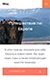
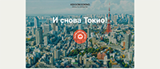
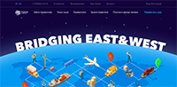
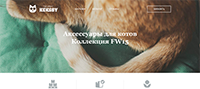

# Примеры работ

Название | Навыки | Скриншоты
|--------|---------|---------|
|Путешествие по Европе|HTML, SCSS, JavaScript |  |
|IP Address Tracker|HTML, SCSS, JavaScript|  |
|Кексобукинг|Преимущественно JavaScript, готовая разметка и стили||
|Кэт энерджи|HTML, Less, JavaScript|  |
|Нёрдс|HTML, CSS, JavaScript||
|Transhub 24|HTML, Less, JavaScript, немного jQuery|  |
|Седона|HTML, CSS||
|Код и Магия|Преимущественно JavaScript, готовая верстка||
|Meeting Ended Modal|HTML, CSS, JavaScript||
|Sign In Modal|HTML, CSS||
|The Great Keksby|HTML, CSS||

>*Большинство проектов создано через прогрессивное улучшение, с адаптивной версткой, фиксированной или резиновой на промежуточных переходах, некоторые изображения оптимизированы, а работа автоматизирована с помощью Gulp или Webpack, при клиент-серверном взаимодействии использовалось API стороннего сервиса.*

